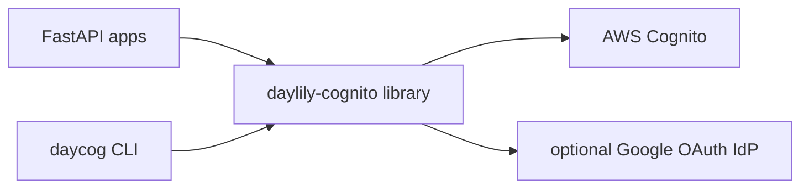

[](https://github.com/Daylily-Informatics/daylily-cognito/releases)
[](https://github.com/Daylily-Informatics/daylily-cognito/tags)
[](https://github.com/Daylily-Informatics/daylily-cognito/actions/workflows/ci.yml)

# daylily-cognito

`daylily-cognito` is the shared Cognito/auth library and operational CLI for the stack. It gives service repos a common way to model pool/app context, build FastAPI auth helpers, and manage Cognito pools, clients, users, groups, and optional Google IdP configuration without each repo inventing its own wrapper.

daylily-cognito owns:
- reusable Cognito configuration objects
- shared auth helpers for FastAPI integrations
- shared Hosted UI browser-session helpers for cookie-backed web login
- the `daycog` operational CLI for pool/app/user/group flows
- Google IdP support and context/config synchronization

daylily-cognito does not own:
- a product’s session UI or page composition
- product-specific RBAC semantics
- non-Cognito identity providers beyond its supported helpers

## Component View



## Prerequisites

- Python 3.9+
- AWS credentials/profile for any live Cognito management
- optional `auth` extra for JWT verification support
- optional Google OAuth client JSON for Google IdP flows

## Getting Started

### Quickstart: Local Library Use

```bash
pip install -e ".[auth]"
```

```python
from daylily_cognito import CognitoConfig, CognitoAuth

config = CognitoConfig(
    name="myapp",
    region="us-west-2",
    user_pool_id="us-west-2_XXXXXXXXX",
    app_client_id="XXXXXXXXXXXXXXXXXXXXXXXXXX",
)
config.validate()

auth = CognitoAuth(
    region=config.region,
    user_pool_id=config.user_pool_id,
    app_client_id=config.app_client_id,
)
```

### Quickstart: Hosted UI Browser Sessions

```python
from typing import Optional

from daylily_cognito import (
    CognitoWebAuthError,
    CognitoWebSessionConfig,
    SessionPrincipal,
    complete_cognito_callback,
    configure_session_middleware,
    load_session_principal,
    start_cognito_login,
)

web_config = CognitoWebSessionConfig(
    domain="myapp.auth.us-west-2.amazoncognito.com",
    client_id="client-id",
    redirect_uri="https://localhost:8912/auth/callback",
    logout_uri="https://localhost:8912/auth/logout",
    public_base_url="https://localhost:8912",
    session_secret_key="change-me",
    session_cookie_name="myapp_session",
    server_instance_id="server-instance-1",
)

configure_session_middleware(app, web_config)

@router.get("/auth/login")
async def auth_login(request: Request):
    return start_cognito_login(request, web_config, request.query_params.get("next"))

@router.get("/auth/callback")
async def auth_callback(request: Request, code: Optional[str] = None, state: Optional[str] = None):
    async def resolve_principal(tokens: dict, request: Request) -> SessionPrincipal:
        claims = verify_claims_somehow(tokens)
        return SessionPrincipal(
            user_sub=claims["sub"],
            email=claims["email"],
            roles=["reader"],
            cognito_groups=claims.get("cognito:groups", []),
            app_context={"tenant_id": claims.get("custom:tenant_id")},
        )

    try:
        return await complete_cognito_callback(request, web_config, code, state, resolve_principal)
    except CognitoWebAuthError as exc:
        return RedirectResponse(f"/auth/error?reason={exc.reason}", status_code=302)

@router.get("/me")
async def me(request: Request):
    principal = load_session_principal(request)
    if principal is None:
        raise HTTPException(status_code=401)
    return principal
```

The browser-session contract enforces:
- explicit service-specific cookie names
- `SameSite=Lax`
- `https_only` derived from the public base URL
- strict OAuth state validation
- normalized session principals without raw OAuth tokens
- restart invalidation through `server_instance_id`

### Quickstart: Hosted UI Browser Sessions

```python
from fastapi import FastAPI, Request
from daylily_cognito import (
    CognitoWebSessionConfig,
    SessionPrincipal,
    complete_cognito_callback,
    configure_session_middleware,
    load_session_principal,
    start_cognito_login,
)

app = FastAPI()
web_config = CognitoWebSessionConfig(
    domain="example.auth.us-west-2.amazoncognito.com",
    client_id="client-id",
    redirect_uri="https://localhost:8912/auth/callback",
    logout_uri="https://localhost:8912/auth/logout",
    public_base_url="https://localhost:8912",
    session_cookie_name="example_session",
    session_secret_key="replace-me",
    server_instance_id="server-instance-id",
)
configure_session_middleware(app, web_config)

@app.get("/auth/login")
async def auth_login(request: Request, next: str = "/"):
    return start_cognito_login(request, web_config, next)

@app.get("/auth/callback")
async def auth_callback(request: Request, code: str = "", state: str = ""):
    async def resolve_principal(tokens: dict, request: Request) -> SessionPrincipal:
        del request
        return SessionPrincipal(
            user_sub="user-sub",
            email="user@example.com",
            roles=["USER"],
            app_context={"tenant_id": "tenant-1"},
        )

    return await complete_cognito_callback(request, web_config, code, state, resolve_principal)

@app.get("/me")
async def me(request: Request):
    principal = load_session_principal(request)
    return {"principal": principal.to_session_dict() if principal else None}
```

Shared browser-session helpers enforce:
- explicit, non-default cookie names
- `SameSite=Lax`
- secure cookies whenever the public base URL is HTTPS
- strict OAuth state validation
- normalized session principals without raw OAuth tokens
- session invalidation when the server instance changes

### Quickstart: CLI Workflow

```bash
source ./activate
daycog --help
daycog status
```

Creating or mutating pools, apps, or users is a live AWS operation. Treat `daycog setup`, `add-app`, `delete-pool`, and similar commands as stateful actions.

## Architecture

### Technology

- Python library for Cognito config/auth helpers
- Typer-based `daycog` CLI
- optional JWT verification helpers
- optional Google IdP integration

### Core Model

The repo revolves around:

- Cognito config contexts
- user pools
- app clients
- users and groups
- environment-variable and config-file loading patterns
- optional Google OAuth IdP wiring

### Runtime Shape

- library package: `daylily_cognito`
- CLI entrypoint: `daycog`
- common workflows: context/config inspection, pool/app creation, app management, user/group operations, Google IdP setup

## Cost Estimates

Approximate only.

- Local-only development with mocked or existing config: near-zero direct cost.
- Live AWS use depends on Cognito usage, domains, MAU, and any external IdP posture; dev/test tends to be modest compared with a full application environment.

## Development Notes

- Canonical local entry path: `source ./activate`
- Use `daycog ...` as the primary operational interface
- Prefer config contexts or namespaced environment variables over ad hoc per-app auth glue

Useful checks:

```bash
source ./activate
daycog --help
pytest -q
```

## Sandboxing

- Safe: docs work, code reading, tests, config inspection, `daycog --help`, and local config-file work
- Requires extra care: any command that creates, edits, or deletes Cognito pools, apps, users, groups, or domains

## Current Docs

- [Docs index](docs/README.md)

## References

- [Amazon Cognito](https://docs.aws.amazon.com/cognito/)
- [FastAPI](https://fastapi.tiangolo.com/)
 
 
