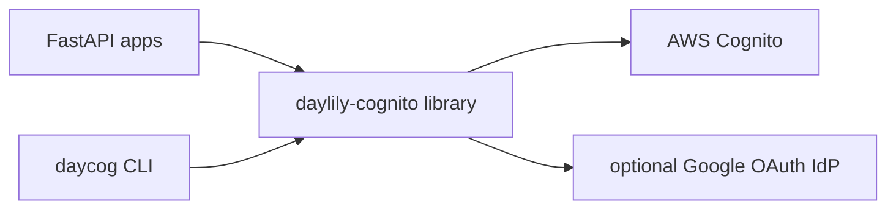

[](https://github.com/Daylily-Informatics/daylily-cognito/releases)
[](https://github.com/Daylily-Informatics/daylily-cognito/tags)
[](https://github.com/Daylily-Informatics/daylily-cognito/actions/workflows/ci.yml)

# daylily-cognito

`daylily-cognito` is the shared Cognito/auth library and operational CLI for the stack. It gives service repos a common way to model pool/app context, build FastAPI auth helpers, and manage Cognito pools, clients, users, groups, and optional Google IdP configuration without each repo inventing its own wrapper.

daylily-cognito owns:
- reusable Cognito configuration objects
- shared auth helpers for FastAPI integrations
- the `daycog` operational CLI for pool/app/user/group flows
- Google IdP support and context/config synchronization

daylily-cognito does not own:
- a product’s session UI or page composition
- product-specific RBAC semantics
- non-Cognito identity providers beyond its supported helpers

## Component View



## Prerequisites

- Python 3.9+
- AWS credentials/profile for any live Cognito management
- optional `auth` extra for JWT verification support
- optional Google OAuth client JSON for Google IdP flows

## Getting Started

### Quickstart: Local Library Use

```bash
pip install -e ".[auth]"
```

```python
from daylily_cognito import CognitoConfig, CognitoAuth

config = CognitoConfig(
    name="myapp",
    region="us-west-2",
    user_pool_id="us-west-2_XXXXXXXXX",
    app_client_id="XXXXXXXXXXXXXXXXXXXXXXXXXX",
)
config.validate()

auth = CognitoAuth(
    region=config.region,
    user_pool_id=config.user_pool_id,
    app_client_id=config.app_client_id,
)
```

### Quickstart: CLI Workflow

```bash
source ./activate
daycog --help
daycog status
```

Creating or mutating pools, apps, or users is a live AWS operation. Treat `daycog setup`, `add-app`, `delete-pool`, and similar commands as stateful actions.

## Architecture

### Technology

- Python library for Cognito config/auth helpers
- Typer-based `daycog` CLI
- optional JWT verification helpers
- optional Google IdP integration

### Core Model

The repo revolves around:

- Cognito config contexts
- user pools
- app clients
- users and groups
- environment-variable and config-file loading patterns
- optional Google OAuth IdP wiring

### Runtime Shape

- library package: `daylily_cognito`
- CLI entrypoint: `daycog`
- common workflows: context/config inspection, pool/app creation, app management, user/group operations, Google IdP setup

## Cost Estimates

Approximate only.

- Local-only development with mocked or existing config: near-zero direct cost.
- Live AWS use depends on Cognito usage, domains, MAU, and any external IdP posture; dev/test tends to be modest compared with a full application environment.

## Development Notes

- Canonical local entry path: `source ./activate`
- Use `daycog ...` as the primary operational interface
- Prefer config contexts or namespaced environment variables over ad hoc per-app auth glue

Useful checks:

```bash
source ./activate
daycog --help
pytest -q
```

## Sandboxing

- Safe: docs work, code reading, tests, config inspection, `daycog --help`, and local config-file work
- Requires extra care: any command that creates, edits, or deletes Cognito pools, apps, users, groups, or domains

## Current Docs

- [Docs index](docs/README.md)

## References

- [Amazon Cognito](https://docs.aws.amazon.com/cognito/)
- [FastAPI](https://fastapi.tiangolo.com/)
